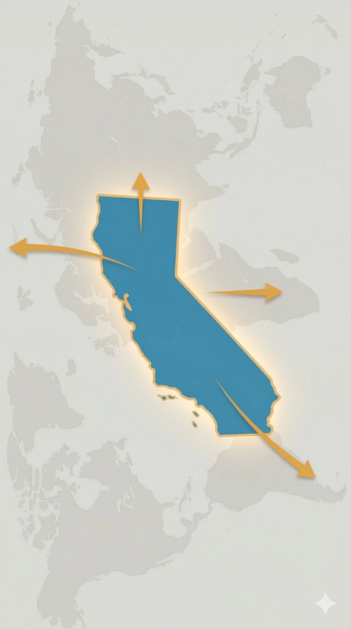

## {width="30%" fig-alt="The Carpentries logo"}

-   Teaching foundational coding and data science skills to researchers worldwide, since 1998
-   Also a train-the-trainer community

{.lightbox width="65%" fig-alt="A world map titled: Workshops by Location, showing the global distribution of Carpentries workshops. Hundreds of orange circles of varying sizes are plotted across all continents (except Antarctica), with each circle representing the number of workshops held at a specific location. Larger circles indicate a higher density of workshops, with significant clusters visible in North America, Western Europe, and parts of Australia."}

## Carpentry \@ UCSB

::::: columns
::: {.column width="40%"}
-   First workshop held in 2014
-   Hosted in the Library since 2019, a cross-campus collaboration
-   Over 100 workshops held to date
:::

::: {.column width="60%"}
{fig-alt="A group of people smiling for a photo during a Software Carpentry workshop."}
:::
:::::

## Extending our reach - UC Carpentries

:::::: columns
:::: {.column width="70%"}
-   Started in 2020 as a UCLA-UCSD-UCB collaboration
-   UCSB Library first participated in 2021
-   243 attendees in 2025 (6th edition)
    -   34 from UCSB (14%)
    -   147 from other UCs (60%)
    -   38 from CSU system (16%)
    -   24 from anywhere else (10%) <small>(Turkiye, Pakistan, Colombia, UK, Canada, Spain, Washington DOH, Massachusetts, Illinois, LBNL, Scripps Research)</small>

::: incremental
-   How did we reach out to them?
    -   We didn't
-   How did they find out?
    -   No idea! But probably through the Carpentries website
:::
::::

::: {.column width="30%"}
{fig-alt="A vertical graphic featuring a blue silhouette of the state of California positioned in the center. Four orange arrows originate from the state and point outward in different directions, symbolizing outreach or the sharing of ideas. The background consists of a very faint, light gray map of the world on a cream-colored textured surface."}
:::
::::::

## Extending our reach - UCSB hybrid/remote workshops

-   Geospatial workshops in 2025 and 2026:
    -   12 attendees from universities across the US, but also from government and museums, and instructors wanting to teach this curriculum
-   Three additional online/hybrid workshops in 2025, reaching 3 non-UCSB attendees
-   Challenge: For instructors, online workshops are not as fun

## Strategies we've used

-   Partner up! Join communities and working groups already working on the topic <small>UC Carpentries, UC GIS Week, UC Love Data Week</small>
-   Ease onboarding with clear scaffolding and instructions  <small> Zoom, Shoreline, Office hours before workshops</small>
-   Have a code of conduct and talk about it at the start of your event
-   What we could do in the future:
    -   Dedicated registration seats for outside groups
    -   Outreach with related communities and past learners
    -   Establish asynchronous help channels (Slack/Discord)

## Discussion

-   Do you know of local communities in SB we can partner with?

. . .

-   Is it feasible to expand while maintaining quality?

. . .

-   How can we tailor our curriculum to reach other communities?

. . .

-   Please reach out:
    -   jose_nino\@ucsb.edu
    -   [[carpentry.library.ucsb.edu](https://carpentry.library.ucsb.edu/)]{style="color: #3498db; text-decoration: underline; font-size: 0.9em;"}
